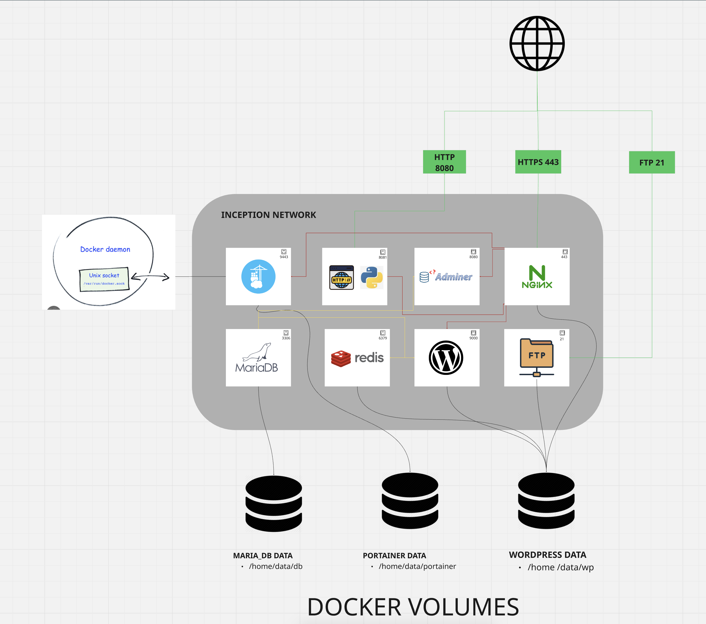
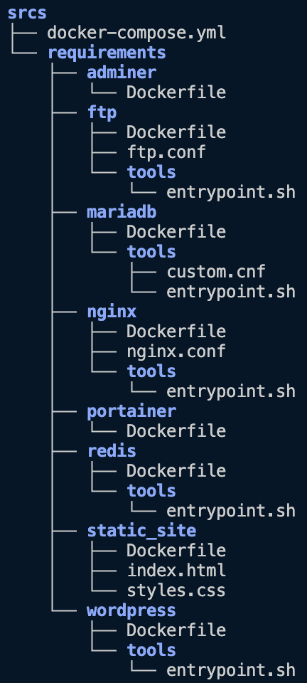

# Inception 42 Project 

This project is designed to deepen your knowledge of system administration through Docker. It involves creating a virtualized infrastructure on a personal virtual machine using Docker Compose. The project requires setting up multiple services such as NGINX, WordPress, MariaDB, Redis, and more. Docker containers will be used to virtualize each service.

## Project Overview

The **Inception Project** is focused on system administration, utilizing Docker to set up a complete infrastructure that consists of various services, including:

- **NGINX** (with SSL/TLS)
- **WordPress** (with PHP-FPM)
- **MariaDB** (for database management)
- **Redis** (for caching)
- **Adminer** (for database management UI)
- **FTP Server** (for file uploads)
- **Static Website** (for showcasing projects or personal information)

The project must be fully contained in Docker and configured using Docker Compose.

---

## 🗺️ Infrastructure Diagram

The following diagram illustrates the full Docker-based architecture for the Inception project:

## Models
In this Docker Compose configuration, the volumes and network models are essential components that enable data persistence, inter-container communication, and isolated service orchestration. Here's a breakdown of their roles and technical significance:

🧱 Volumes Model
Docker volumes in this project are declared using the driver_opts method with the bind type. This ensures that each service has persistent storage that is mapped to a specific directory on the host system. Unlike anonymous volumes that disappear when a container is removed, these named bind mounts ensure data survives container or host restarts. They are especially useful for stateful services like databases and CMS.

Declared Volumes:
mariadb_data → /home/nhayoun/data/db:
Binds to the MariaDB container at /var/lib/mysql, this directory holds the actual database files. Persisting this volume ensures that the database retains all data even after container deletion or rebuild.

wordpress_data → /home/nhayoun/data/wp:
This volume is shared between nginx, wordpress, ftp, and even redis (for convenience). It stores the WordPress site files (wp-content, themes, uploads, etc.) and is the most reused volume in the stack, which allows services to interact with and serve WordPress content seamlessly.

static_site_data → /home/nhayoun/data/static:
Mounted inside the static site container to serve prebuilt static assets like HTML, CSS, or JS files.

portainer_data → /home/nhayoun/data/portainer:
This is the persistent storage for Portainer's internal configuration and metadata. Without this, all UI settings, endpoints, and container history would be lost on container restart.

/var/run/docker.sock:/var/run/docker.sock (Portainer):
This is a special bind mount that allows Portainer to communicate with the Docker daemon directly, giving it full control and visibility over all containers on the host.

Volumes provide the necessary stateful behavior to otherwise stateless containers and form the backbone for data integrity in this stack.

🌐 Network Model
This project uses a single user-defined bridge network called inception. Unlike Docker’s default bridge network, user-defined bridge networks offer name-based DNS resolution, which means that services can communicate with each other using their container names as hostnames (e.g., nginx can reach wordpress:9000).

This shared network isolates all containers from the host unless explicitly mapped via ports, and enables:

Service discovery: For example, NGINX uses proxy_pass to forward traffic to adminer:8080, static_site:8081, or portainer:9443.

Internal communication without exposing all services to the host.

Security boundaries: Only one public-facing service (nginx) is exposed directly to the outside world. The rest communicate through the shared inception network and are protected from external interference unless explicitly published.

By leveraging this bridge network, the architecture is modular, secure, and scalable, allowing additional services to be added without port conflicts or isolation concerns.

## Prerequisites

Before starting, ensure the following tools are installed on your virtual machine:

- Docker
- Docker Compose
- Make (for building the containers)

Ensure that your system is configured with Docker support and that you have a running virtual machine to host the containers.

## Docker Setup 
### File Structure

Each service has its own dedicated folder under srcs/requirements/, containing the necessary Dockerfiles and configuration files for building the container images.

### Environment Variables

*** .env file contains environment variables used by the Docker Compose file and the services. ***

Ensure that you configure the following environment variables in the .env file:

WORDPRESS_DB_USER=your-mysql-user
WORDPRESS_DB_PASSWORD=your-mysql-password
WORDPRESS_DB_ROOT_PASSWORD=your-root-password
WORDPRESS_DB_DATABASE=your-database-name
WP_SITE_URL=http://your-domain.42.fr
WP_SITE_TITLE=your-site-title
WP_ADMIN_USER=your-admin-username
WP_ADMIN_PASSWORD=your-admin-password
WP_ADMIN_EMAIL=your-admin-email
FTP_USER=your-ftp-user
FTP_PASSWORD=your-ftp-password

### Docker Compose Configuration
The `docker-compose.yml` file orchestrates the services, defining how each container interacts with others and specifying the build context for each service.
It includes configurations for:
- NGINX with SSL/TLS support
- WordPress with PHP-FPM
- MariaDB for database management
- Redis for caching
- Adminer for database management UI
- FTP Server for file uploads
- Static Website for showcasing projects or personal information
- Volume mounts for persistent data storage
- Network configuration to allow communication between containers

### Makefile
The `Makefile` provides commands to build and run the Docker containers easily. It includes targets for building images, starting services, and cleaning up resources.

### How To Run 

Ensure Docker and Docker Compose are installed on your machine.

Set up your domain name to point to your local machine's IP address (e.g., your-login.42.fr).

Make sure that the volumes in the `docker-compose.yml` file are correctly set up to persist data across container restarts.

Make sure to set the environment variables in the `.env` file according to your setup.

Run the project using the commands:

make build

make up

*** This will build the required images and bring up the services as containers. ***

